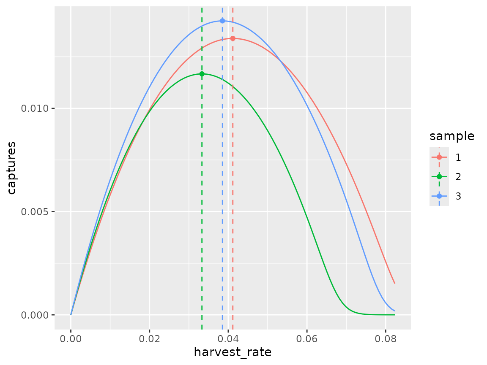
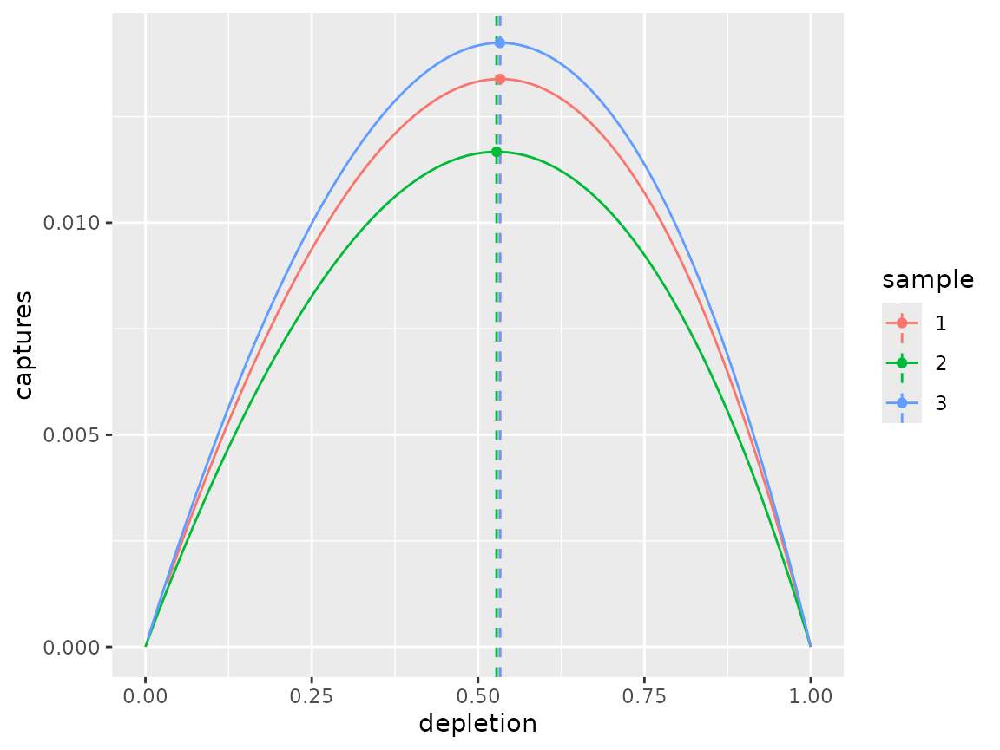
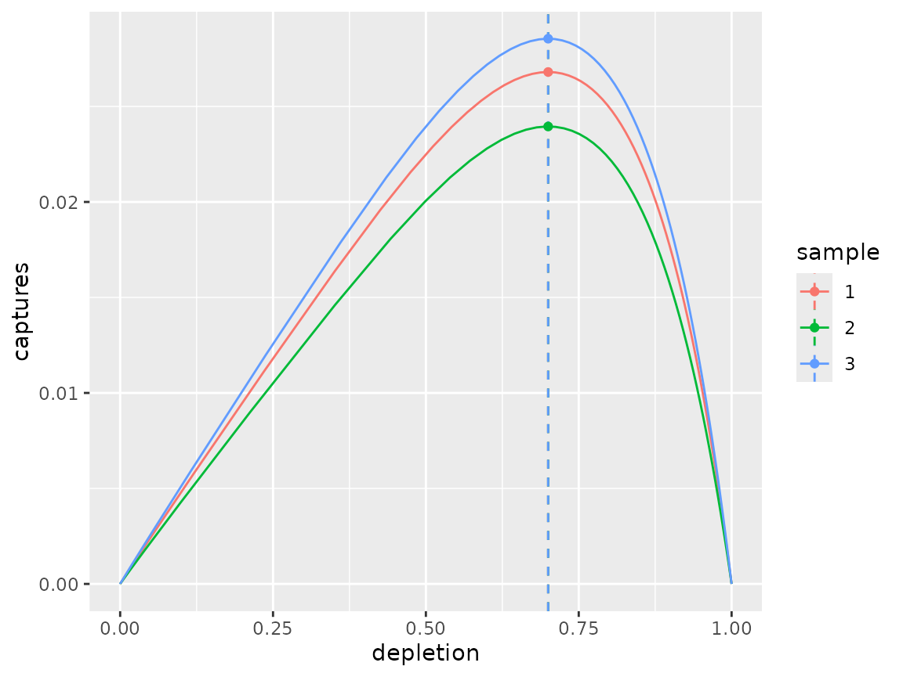

# Operating model demonstration

``` r

library(om)
#> Loading required package: RTMB
#> om version 0.3.2 (19-Sep-2026)
#> 
#> Attaching package: 'om'
#> The following object is masked from 'package:base':
#> 
#>     sample
```

``` r

library(dplyr)
library(ggplot2)
```

Setup om-class object for age-based operating model

``` r

om_object <- om(ages = 0:12, samples = 3L, time = 201)
```

Set-up list of parameter distributions required for population dynamics
function:

``` r

om_object <- om_object %>% load_pars(list(
    's' = distribution(pars = c(2.2, 0.2), density = "logitnormal", name = "adult survivorship"),
    'b' = distribution(pars = c(0.0, 0.2), density = "lognormal", name = "female fecundity"),
    'm' = distribution(value = 4, name = "age at maturity"),
    'l' = distribution(value = 0.7, name = "immature survivorship multiplier")
))
```

The intrinsic growth rate is calculated automatically when parameters
are assigned:

``` r

plot(lambda(om_object))
```


The intrinsic growth can be assumed to be the maximum, or an alternative
can be supplied:

``` r

om_object <- om_object %>% load_rmax()
```

Assumed to be a zero-truncated normal:

``` r

plot(om_object@pars$rmax)
```


``` r

om_object <- om_object %>% update_pars(list(
    'o' = distribution(value = 1, name = "age at observation"),
    'v' = distribution(value = 4, name = "age at selectivity"),
    'K' = distribution(value = 1, name = "carrying capacity")
))

# load uncertainty
om_object <- om_object %>% load_cvs(list(
    'survivorship' = 0.05,
    'birth'        = 0.01,
    'observation'  = 0.00,
    'mortality'    = 0.00)
)
```

``` r

# assume shape
shape(om_object) <- 1

# deterministic ref. points
om_object0 <- rp(om_object, stochastic = FALSE, time = 200L)
targets(om_object0)
#> $captures
#> # A tibble: 3 × 2
#>   sample  value
#>    <int>  <dbl>
#> 1      1 0.0134
#> 2      2 0.0117
#> 3      3 0.0142
#> 
#> $harvest_rate
#> # A tibble: 3 × 2
#>   sample  value
#>    <int>  <dbl>
#> 1      1 0.0412
#> 2      2 0.0333
#> 3      3 0.0385
#> 
#> $depletion
#> # A tibble: 3 × 2
#>   sample value
#>    <int> <dbl>
#> 1      1 0.533
#> 2      2 0.528
#> 3      3 0.533

dfr0 <- spf(om_object0, harvest_rate = seq(0.00, max(targets(om_object0)$harvest_rate$value) * 2, length = 101))
dfr1 <-  data.frame(sample = as.character(1:om_object@samples), harvest_rate = om_object0@targets$harvest_rate, captures = om_object0@targets$captures, depletion = om_object0@targets$depletion)
ggplot() + 
  geom_line(data = dfr0, aes(x = harvest_rate, y = captures, col = sample)) +
  geom_vline(data = dfr1, aes(xintercept = harvest_rate, col = sample), linetype = "dashed") +
  geom_point(data = dfr1, aes(x = harvest_rate, y = captures, col = sample))
```



``` r

ggplot() + 
  geom_line(data = dfr0, aes(x = depletion, y = captures, col = sample)) +
  geom_vline(data = dfr1, aes(xintercept = depletion, col = sample), linetype = "dashed") +
  geom_point(data = dfr1, aes(x = depletion, y = captures, col = sample))
```



``` r

# population dynamics
om_object0 <- pdyn(om_object0, stochastic = FALSE, initial_depletion = 0.1)
dynplot(om_object0)
```


``` r


#diagnostics(om_object0)
#objectives(om_object0)
```

``` r

# estimate shape for assumed d_mnpl assumption
om_object1 <- shape(om_object, depletion = 0.7, stochastic = FALSE, time = 200L)
shape(om_object1)
#> [1] 4.109308 4.255719 4.117766

# deterministic ref. points
om_object1 <- rp(om_object1)
targets(om_object1)
#> $captures
#> # A tibble: 3 × 2
#>   sample  value
#>    <int>  <dbl>
#> 1      1 0.0268
#> 2      2 0.0240
#> 3      3 0.0285
#> 
#> $harvest_rate
#> # A tibble: 3 × 2
#>   sample  value
#>    <int>  <dbl>
#> 1      1 0.0660
#> 2      2 0.0539
#> 3      3 0.0619
#> 
#> $depletion
#> # A tibble: 3 × 2
#>   sample value
#>    <int> <dbl>
#> 1      1 0.700
#> 2      2 0.700
#> 3      3 0.700

dfr0 <- spf(om_object1, harvest_rate = seq(0.00, max(targets(om_object1)$harvest_rate$value) * 2, length = 101))
dfr1 <-  data.frame(sample = as.character(1:om_object@samples), harvest_rate = om_object1@targets$harvest_rate, captures = om_object1@targets$captures, depletion = om_object1@targets$depletion)
ggplot() + 
  geom_line(data = dfr0, aes(x = harvest_rate, y = captures, col = sample)) +
  geom_vline(data = dfr1, aes(xintercept = harvest_rate, col = sample), linetype = "dashed") +
  geom_point(data = dfr1, aes(x = harvest_rate, y = captures, col = sample))
```


``` r

ggplot() + 
  geom_line(data = dfr0, aes(x = depletion, y = captures, col = sample)) +
  geom_vline(data = dfr1, aes(xintercept = depletion, col = sample), linetype = "dashed") +
  geom_point(data = dfr1, aes(x = depletion, y = captures, col = sample))
```



``` r


om_object1 <- pdyn(om_object1, stochastic = FALSE, initial_depletion = 0.3, use_rmax = TRUE)
dynplot(om_object1)
```


``` r


#diagnostics(om_object1)
#objectives(om_object1)
```
