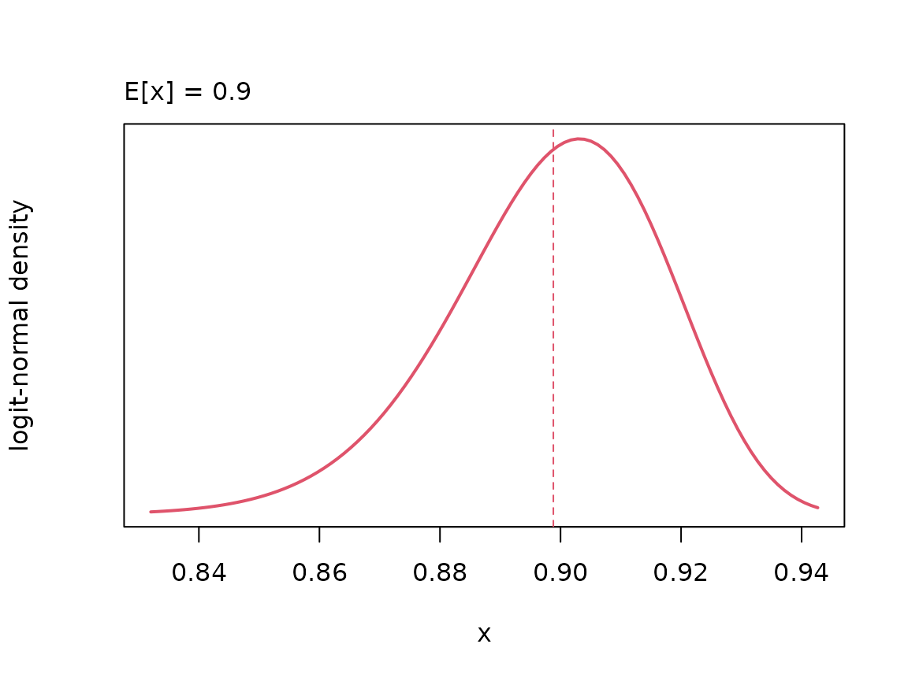
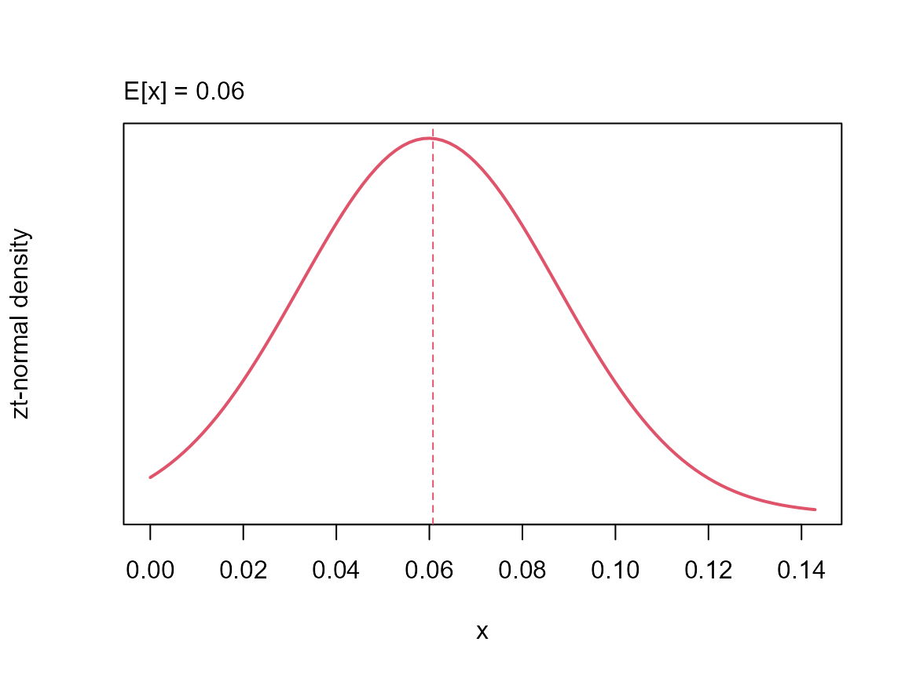
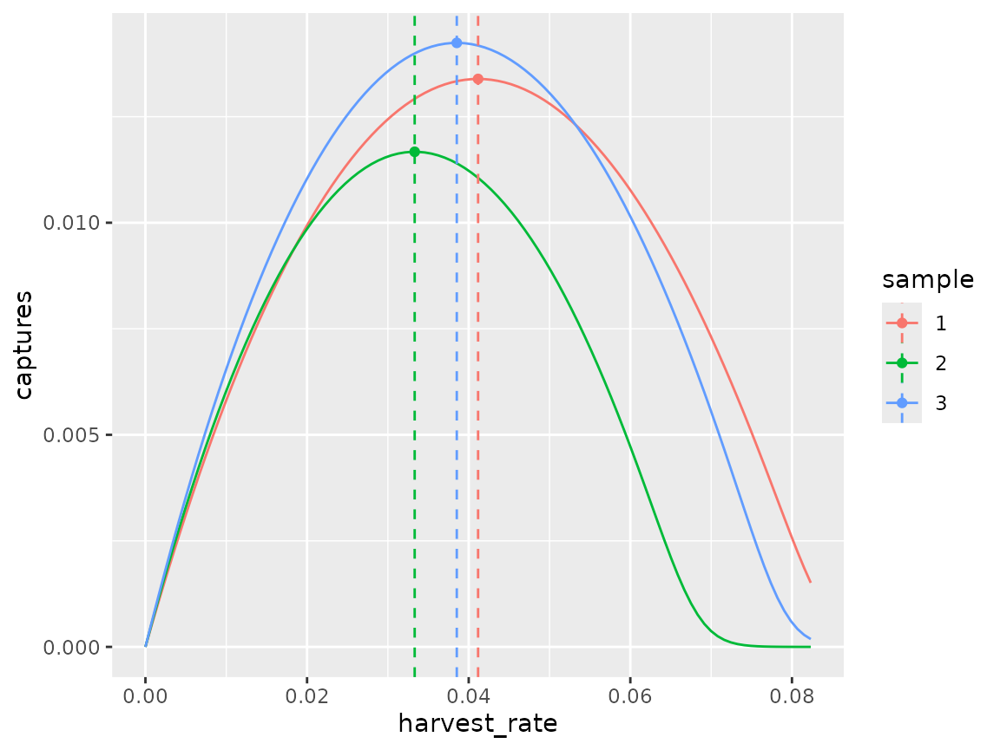
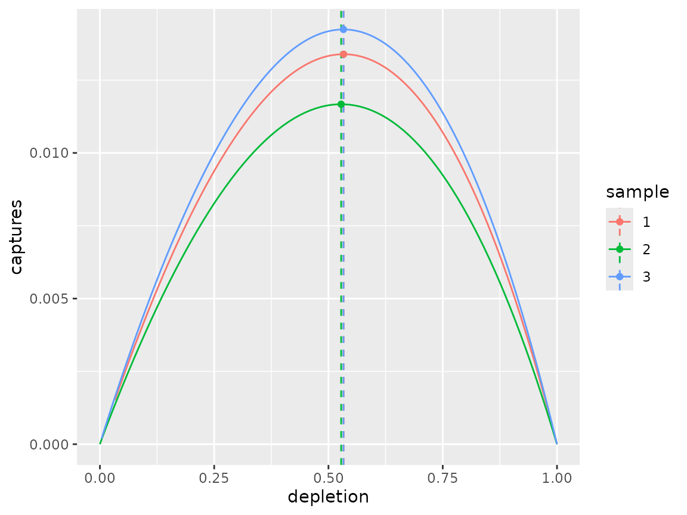
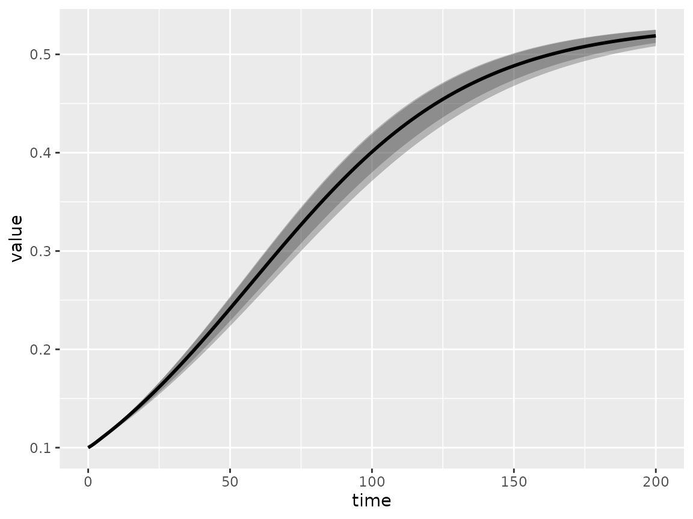
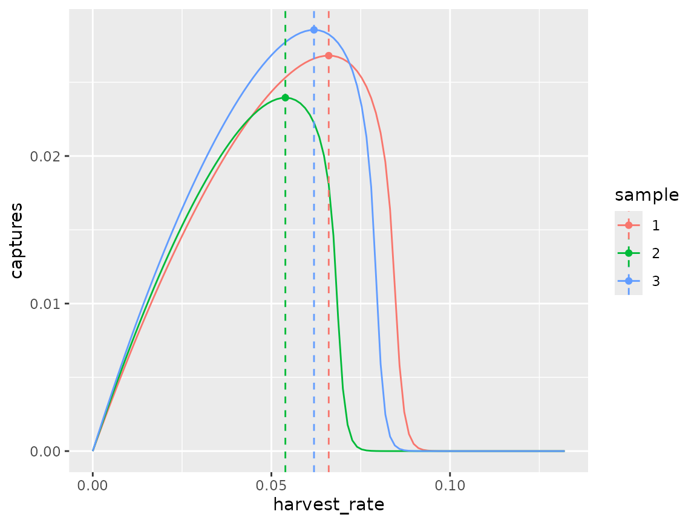
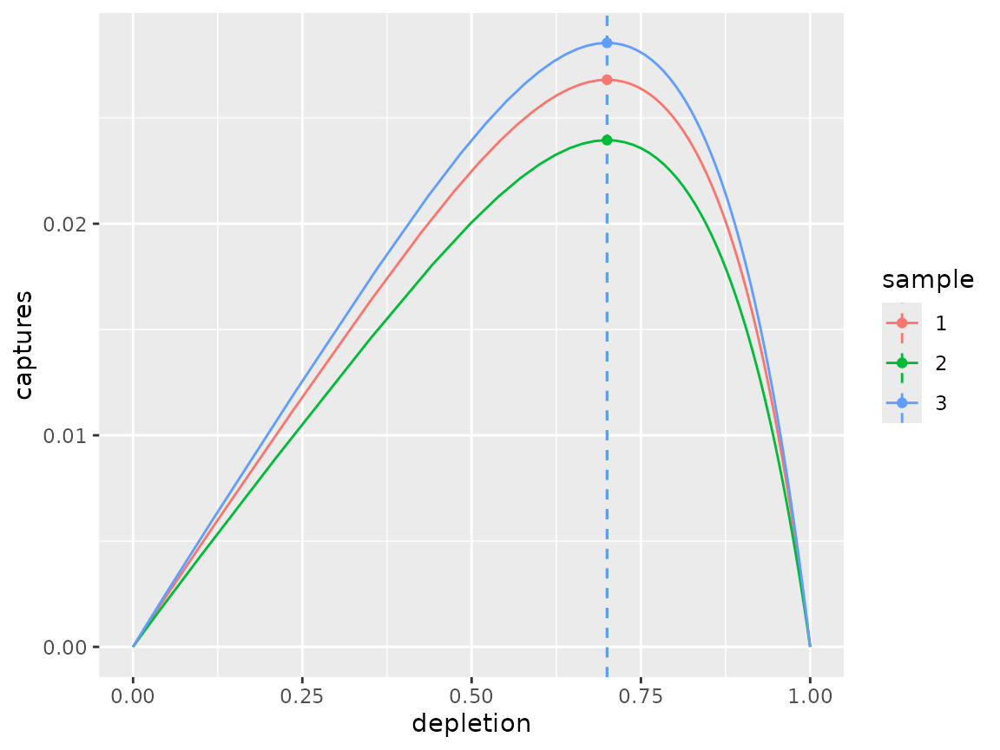
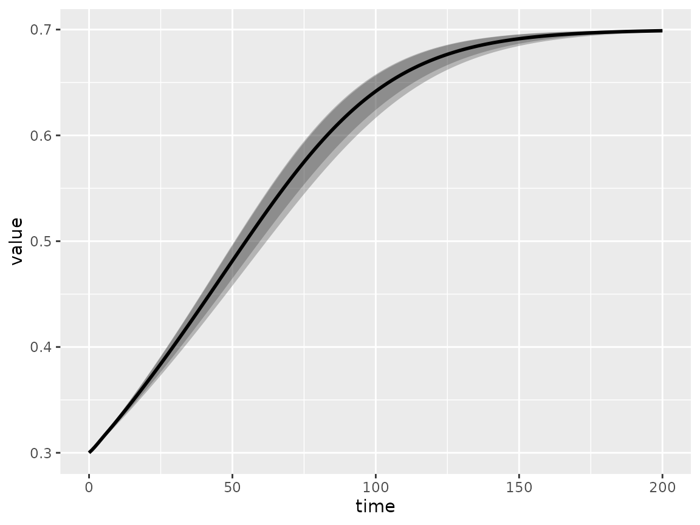

# Operating model demonstration

``` r

library(om)
#> Loading required package: RTMB
#> om version 0.3.3 (20-Sep-2026)
#> 
#> Attaching package: 'om'
#> The following object is masked from 'package:base':
#> 
#>     sample
```

``` r

library(dplyr)
library(ggplot2)
```

## Setup

Setup operating model class object, assuming 3 samples from the input
life-history distribution and a default projection period of 200 years.

``` r

om_object <- om(ages = 0:12, samples = 3L, time = 201)
```

Set-up list of parameter distributions required for population dynamics
function:

``` r

om_object <- om_object %>%
    load_pars(list(s = distribution(pars = c(2.2, 0.2), density = "logitnormal", name = "adult survivorship"),
        b = distribution(pars = c(0, 0.2), density = "lognormal", name = "female fecundity"), m = distribution(value = 4,
            name = "age at maturity"), l = distribution(value = 0.7, name = "immature survivorship multiplier")))
```

Each parameter is stored as a `distribution` class object and assigned
to the `om_object@pars` slot. A simple plotting function can be used to
quickly visualise the parameter input distributions. For example:

``` r

plot(om_object@pars$s)
```



The intrinsic growth rate is calculated automatically when parameters
are assigned and stored in `om_object@pars$r`. There exists a
[`lambda()`](https://github.com/protected-species-management/operating-model/om/reference/lambda.md)
function for extracting the intrinsic growth on either the natural or
logarithmic scale. For example:

``` r

plot(lambda(om_object))
```


The intrinsic growth can be assumed to be the maximum, or an alternative
can be supplied. The default behaviour assigns `om_object@pars$r` to
`om_object@pars$rmax` but truncates the distribution at zero:

``` r

om_object <- om_object %>%
    load_rmax()

plot(om_object@pars$rmax)
```



To estimate the reference points, we are also required to load the
observation and selectivity paramter distributions:

``` r

om_object <- om_object %>%
    update_pars(list(o = distribution(value = 1, name = "age at observation"), v = distribution(value = 4,
        name = "age at selectivity")))
```

By default the 1+ carrying capacity is set to one:

``` r

om_object@pars$K
```

For the projections, uncertainty is required:

``` r

# load uncertainty
om_object <- om_object %>%
    load_cvs(list(survivorship = 0.05, birth = 0.01, observation = 0, mortality = 0))
```

## Fixed shape

Given the input parameter distributions, the shape parameter determines
the depeletion at MNPL. This can be illustrated using a fixed shape
value.

``` r

# assume shape
shape(om_object) <- 1

# deterministic ref. points
om_object0 <- rp(om_object, stochastic = FALSE, time = 200L)

targets(om_object0)
#> $captures
#> # A tibble: 3 × 2
#>   sample  value
#>    <int>  <dbl>
#> 1      1 0.0134
#> 2      2 0.0117
#> 3      3 0.0142
#> 
#> $harvest_rate
#> # A tibble: 3 × 2
#>   sample  value
#>    <int>  <dbl>
#> 1      1 0.0412
#> 2      2 0.0333
#> 3      3 0.0385
#> 
#> $depletion
#> # A tibble: 3 × 2
#>   sample value
#>    <int> <dbl>
#> 1      1 0.533
#> 2      2 0.528
#> 3      3 0.533
```

The
[`spf()`](https://github.com/protected-species-management/operating-model/om/reference/spf.md)
function can be useful for plotting the surplus production functions
being assumed by the model:

``` r

dfr0 <- spf(om_object0, harvest_rate = seq(0, max(targets(om_object0)$harvest_rate$value) * 2, length = 101))
dfr1 <- data.frame(sample = as.character(1:om_object@samples), harvest_rate = om_object0@targets$harvest_rate,
    captures = om_object0@targets$captures, depletion = om_object0@targets$depletion)
ggplot() + geom_line(data = dfr0, aes(x = harvest_rate, y = captures, col = sample)) + geom_vline(data = dfr1,
    aes(xintercept = harvest_rate, col = sample), linetype = "dashed") + geom_point(data = dfr1,
    aes(x = harvest_rate, y = captures, col = sample))
```



``` r

ggplot() + geom_line(data = dfr0, aes(x = depletion, y = captures, col = sample)) + geom_vline(data = dfr1,
    aes(xintercept = depletion, col = sample), linetype = "dashed") + geom_point(data = dfr1, aes(x = depletion,
    y = captures, col = sample))
```



When performing a stochastic projection, uncertainty is a consequence of
the life-history parameter distributions only. By default, projections
take place assuming a harvest rate equal the harvest rate at MNPL:

``` r

om_object0@harvest_rate
#> function (object, numbers, selectivity, pst, i) 
#> {
#>     ifelse(all(is.na(object@targets$harvest_rate)), 0, object@targets$harvest_rate[i])
#> }
#> <environment: 0x563327595b00>
```

``` r

# population dynamics
om_object0 <- pdyn(om_object0, stochastic = FALSE, initial_depletion = 0.1)
dynplot(om_object0)
```



Diagnostics are available per sample:

``` r

diagnostics(om_object0)
#> $captures
#> # A tibble: 600 × 4
#>    sample iteration  time   value
#>    <chr>      <int> <int>   <dbl>
#>  1 1              1     0 0.00234
#>  2 2              1     0 0.00208
#>  3 3              1     0 0.00248
#>  4 1              1     1 0.00241
#>  5 2              1     1 0.00213
#>  6 3              1     1 0.00256
#>  7 1              1     2 0.00247
#>  8 2              1     2 0.00218
#>  9 3              1     2 0.00263
#> 10 1              1     3 0.00252
#> # ℹ 590 more rows
#> 
#> $depletion
#> # A tibble: 603 × 4
#>    sample iteration  time  value
#>    <chr>      <int> <int>  <dbl>
#>  1 1              1     0 0.1000
#>  2 2              1     0 0.1000
#>  3 3              1     0 0.1000
#>  4 1              1     1 0.102 
#>  5 2              1     1 0.102 
#>  6 3              1     1 0.102 
#>  7 1              1     2 0.104 
#>  8 2              1     2 0.103 
#>  9 3              1     2 0.104 
#> 10 1              1     3 0.106 
#> # ℹ 593 more rows
#> 
#> $harvest_rate
#> # A tibble: 600 × 4
#>    sample iteration  time  value
#>    <chr>      <int> <int>  <dbl>
#>  1 1              1     0 0.0412
#>  2 2              1     0 0.0333
#>  3 3              1     0 0.0385
#>  4 1              1     1 0.0412
#>  5 2              1     1 0.0333
#>  6 3              1     1 0.0385
#>  7 1              1     2 0.0412
#>  8 2              1     2 0.0333
#>  9 3              1     2 0.0385
#> 10 1              1     3 0.0412
#> # ℹ 590 more rows
```

## Estimated shape

The shape can be estimated per life-history sample using the `shape`
function, in which case the desired target depletion must be specified:

``` r

# estimate shape for assumed d_mnpl assumption
om_object1 <- shape(om_object, depletion = 0.7, stochastic = FALSE, time = 200L)
shape(om_object1)
#> [1] 4.109308 4.255719 4.117766
```

As before reference points can be estimated and the surplus production
function(s) plotted:

``` r

# deterministic ref. points
om_object1 <- rp(om_object1)
targets(om_object1)
#> $captures
#> # A tibble: 3 × 2
#>   sample  value
#>    <int>  <dbl>
#> 1      1 0.0268
#> 2      2 0.0240
#> 3      3 0.0285
#> 
#> $harvest_rate
#> # A tibble: 3 × 2
#>   sample  value
#>    <int>  <dbl>
#> 1      1 0.0660
#> 2      2 0.0539
#> 3      3 0.0619
#> 
#> $depletion
#> # A tibble: 3 × 2
#>   sample value
#>    <int> <dbl>
#> 1      1 0.700
#> 2      2 0.700
#> 3      3 0.700

dfr0 <- spf(om_object1, harvest_rate = seq(0, max(targets(om_object1)$harvest_rate$value) * 2, length = 101))
dfr1 <- data.frame(sample = as.character(1:om_object@samples), harvest_rate = om_object1@targets$harvest_rate,
    captures = om_object1@targets$captures, depletion = om_object1@targets$depletion)
ggplot() + geom_line(data = dfr0, aes(x = harvest_rate, y = captures, col = sample)) + geom_vline(data = dfr1,
    aes(xintercept = harvest_rate, col = sample), linetype = "dashed") + geom_point(data = dfr1,
    aes(x = harvest_rate, y = captures, col = sample))
```



``` r

ggplot() + geom_line(data = dfr0, aes(x = depletion, y = captures, col = sample)) + geom_vline(data = dfr1,
    aes(xintercept = depletion, col = sample), linetype = "dashed") + geom_point(data = dfr1, aes(x = depletion,
    y = captures, col = sample))
```



Projection confirms that the population will converge on the depletion
at MNPL specified during estimate of the shape:

``` r

om_object1 <- pdyn(om_object1, stochastic = FALSE, initial_depletion = 0.3, use_rmax = TRUE)
dynplot(om_object1)
```



``` r


diagnostics(om_object1)
#> $captures
#> # A tibble: 600 × 4
#>    sample iteration  time   value
#>    <chr>      <int> <int>   <dbl>
#>  1 1              1     0 0.0111 
#>  2 2              1     0 0.00997
#>  3 3              1     0 0.0118 
#>  4 1              1     1 0.0113 
#>  5 2              1     1 0.0101 
#>  6 3              1     1 0.0120 
#>  7 1              1     2 0.0114 
#>  8 2              1     2 0.0102 
#>  9 3              1     2 0.0121 
#> 10 1              1     3 0.0115 
#> # ℹ 590 more rows
#> 
#> $depletion
#> # A tibble: 603 × 4
#>    sample iteration  time value
#>    <chr>      <int> <int> <dbl>
#>  1 1              1     0 0.300
#>  2 2              1     0 0.300
#>  3 3              1     0 0.300
#>  4 1              1     1 0.303
#>  5 2              1     1 0.302
#>  6 3              1     1 0.303
#>  7 1              1     2 0.306
#>  8 2              1     2 0.305
#>  9 3              1     2 0.306
#> 10 1              1     3 0.309
#> # ℹ 593 more rows
#> 
#> $harvest_rate
#> # A tibble: 600 × 4
#>    sample iteration  time  value
#>    <chr>      <int> <int>  <dbl>
#>  1 1              1     0 0.0660
#>  2 2              1     0 0.0539
#>  3 3              1     0 0.0619
#>  4 1              1     1 0.0660
#>  5 2              1     1 0.0539
#>  6 3              1     1 0.0619
#>  7 1              1     2 0.0660
#>  8 2              1     2 0.0539
#>  9 3              1     2 0.0619
#> 10 1              1     3 0.0660
#> # ℹ 590 more rows
```
