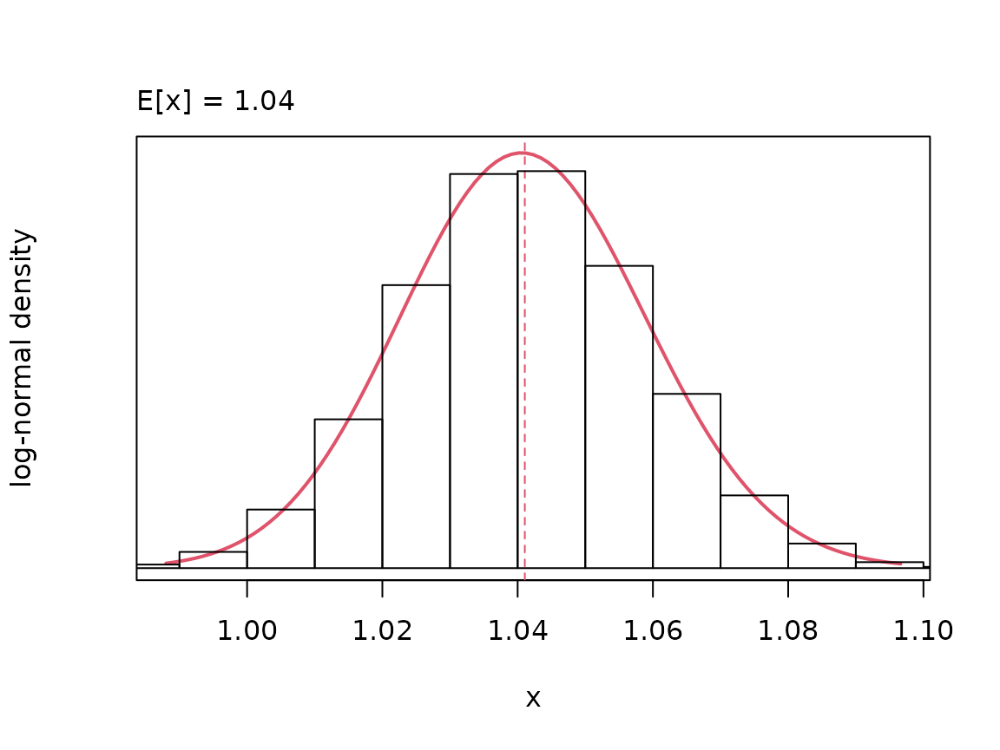
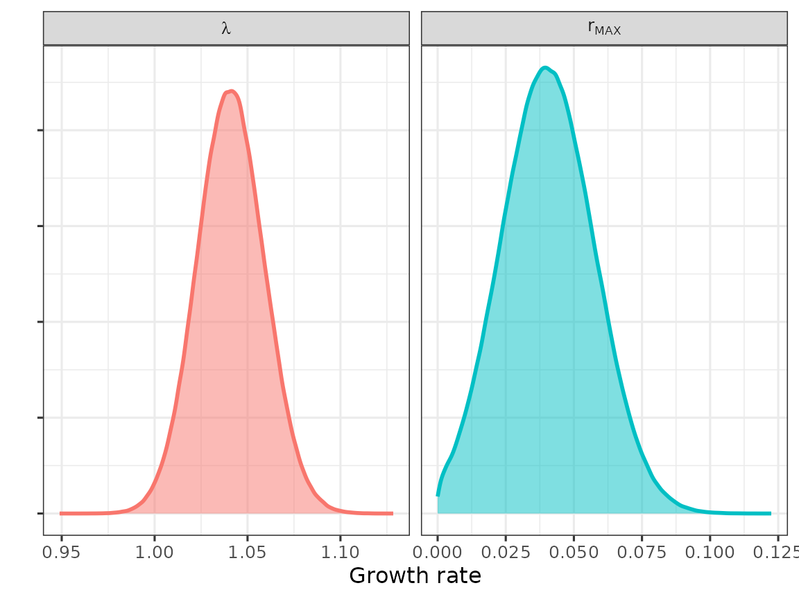
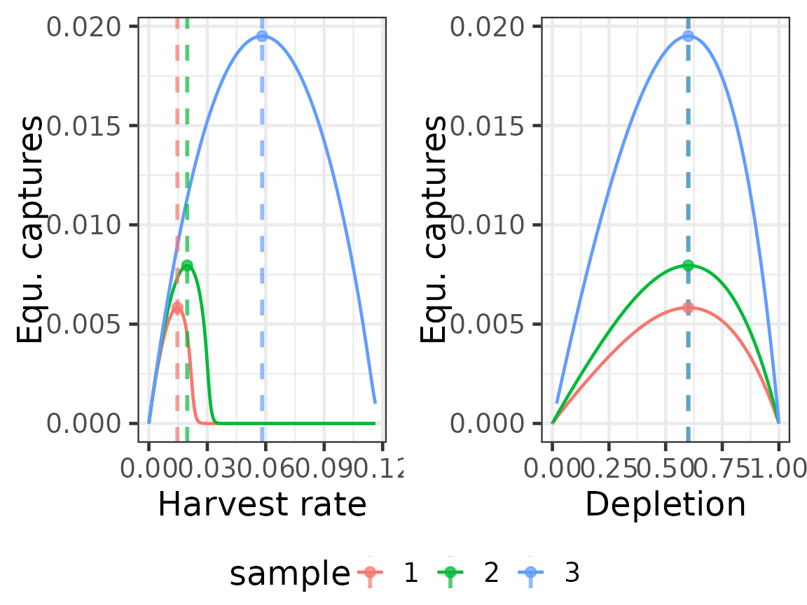
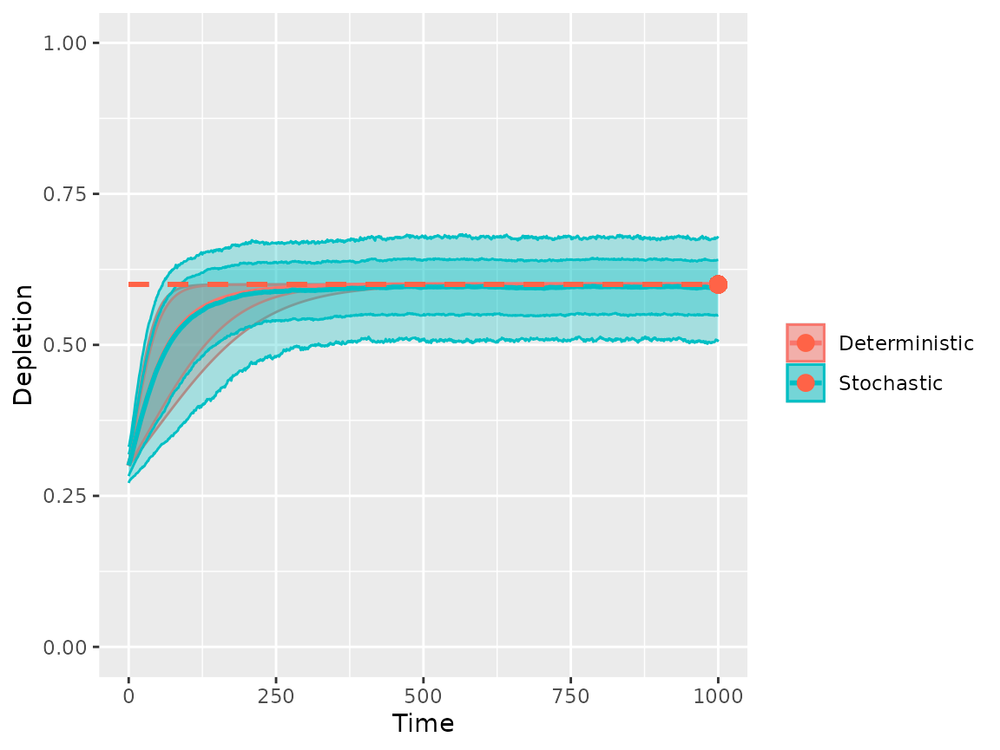

# Operating model setup for Hector's dolphin

``` r

library(om)
#> Loading required package: RTMB
#> om version 0.3.3 (20-Sep-2026)
#> 
#> Attaching package: 'om'
#> The following object is masked from 'package:base':
#> 
#>     sample
```

``` r

library(dplyr)
library(ggplot2)
library(ggpubr)
```

## Setup

``` r

# set-up
om_object <- om(ages = 0:12, samples = 30, time = 0:200)

#######################################
# calculate ref. points using lh pars #
# consistent with rmax                #
#######################################

# get pars
s_pars   <- as.numeric(unlist(logitnorm_pars(0.95, 0.2)[1:2]))
b_pars   <- c(9.61, 13.86)
m_pars   <- c(6, 8)
l_values <- 0.9

# load pars to calculate r
om_object <- om_object %>% load_pars(list(
    # parametric sampling
    's' = distribution(pars = s_pars, density = "logitnormal", name = "adult survivorship"),
    'b' = distribution(pars = b_pars, density = "beta",        name = "female fecundity"),
    'm' = distribution(pars = m_pars, density = "int-uniform", name = "age at maturity"),
    # non-parametric sampling
    'l' = distribution(values = l_values, name = "age zero survivorship multiplier")
))

# check r
plot(lambda(om_object))
```



``` r


# assign r > 0 -> rmax
# (used to estimate the PST)
om_object <- om_object %>% load_rmax()

# assign selectivity
# (used to calculate MNPL)
om_object <- om_object %>% update_pars(list(
    # parametric sampling
    'v' = distribution(pars = m_pars, density = "int-uniform", name = "age at selectivity"),
    'o' = distribution(pars = m_pars, density = "int-uniform", name = "age at observation")
))
```

## Check population growth

``` r

# plot lambda and rmax
dfr <- bind_rows(data.frame(value = exp(sample(om_object@pars$r, size = 1e+06)), par = "lambda"),
    data.frame(value = sample(om_object@pars$rmax, size = 1e+06), par = "r[MAX]"))

gg <- ggplot(dfr) + geom_density(aes(x = value, fill = par, col = par), linewidth = 1, alpha = 0.5) +
    facet_wrap(~par, labeller = label_parsed, scales = "free_x") + theme_bw(base_size = 12) + theme(axis.text.y = element_blank()) +
    labs(x = "Growth rate", y = "", fill = "", col = "") + guides(fill = "none", col = "none")
print(gg)
```



## Estimate reference points

``` r

om_object <- om_object %>%
    shape(depletion = 0.6, stochastic = FALSE) %>%
    rp()
targets(om_object)$depletion
#> # A tibble: 30 × 2
#>    sample value
#>     <int> <dbl>
#>  1      1 0.600
#>  2      2 0.600
#>  3      3 0.600
#>  4      4 0.600
#>  5      5 0.600
#>  6      6 0.600
#>  7      7 0.600
#>  8      8 0.600
#>  9      9 0.600
#> 10     10 0.600
#> # ℹ 20 more rows

# plot surplus production function using sub-samples of life-history inputs
om_object_subsample <- om_object
samples(om_object_subsample) <- 3

dfr0 <- spf(om_object_subsample, harvest_rate = seq(0, max(om_object_subsample@targets$harvest_rate) *
    2, length = 1001))
dfr1 <- bind_rows(targets(om_object_subsample), .id = "rp") %>%
    tidyr::pivot_wider(names_from = rp) %>%
    mutate(sample = as.character(sample))

gg1 <- ggplot(dfr0, aes(harvest_rate, captures, col = sample))
gg1 <- gg1 + geom_line() + labs(x = "Harvest rate", y = "Equ. captures") + geom_vline(data = dfr1,
    aes(xintercept = harvest_rate, col = sample), alpha = 0.7, linewidth = 1, linetype = "dashed") +
    geom_point(data = dfr1, aes(x = harvest_rate, y = captures, col = sample), alpha = 0.7, size = 2) +
    theme_bw(base_size = 18)

gg2 <- ggplot(dfr0, aes(depletion, captures, col = sample))
gg2 <- gg2 + geom_line() + labs(x = "Depletion", y = "Equ. captures") + geom_vline(data = dfr1,
    aes(xintercept = depletion, col = sample), alpha = 0.7, linewidth = 1, linetype = "dashed") +
    geom_point(data = dfr1, aes(x = depletion, y = captures, col = sample), alpha = 0.7, size = 2) +
    theme_bw(base_size = 18)

gg <- ggarrange(gg1, gg2, ncol = 2, common.legend = TRUE, legend = "bottom")
print(gg)
```



## Project to equilibrium

``` r

# load default uncertainty
om_object <- om_object %>%
    load_cvs(list(survivorship = 0.15, birth = 0.05, numbers = 0, capture = 0))
om_object <- om_object %>%
    load_quantiles(list(numbers = 0))

# test equilibrium population dynamics
om_object_proj1 <- pdyn(om_object, stochastic = FALSE, initial_depletion = 0.3, time = 1000)
om_object_proj2 <- pdyn(om_object, stochastic = TRUE, initial_depletion = 0.3, time = 1000, iterations = 100)
gg <- dynplot(om_object_proj1, om_object_proj2, labels = c("Deterministic", "Stochastic"))
gg <- gg + geom_segment(x = 0, xend = max(om_object_proj1@time), y = mean(targets(om_object_proj1)$depletion$value),
    col = "tomato", linetype = "dashed", linewidth = 1) + geom_point(x = max(om_object_proj1@time),
    y = mean(targets(om_object_proj1)$depletion$value), col = "tomato", size = 3) + labs(x = "Time",
    y = "Depletion", col = "", fill = "") + scale_y_continuous(limits = c(0, 1))
print(gg)
```


